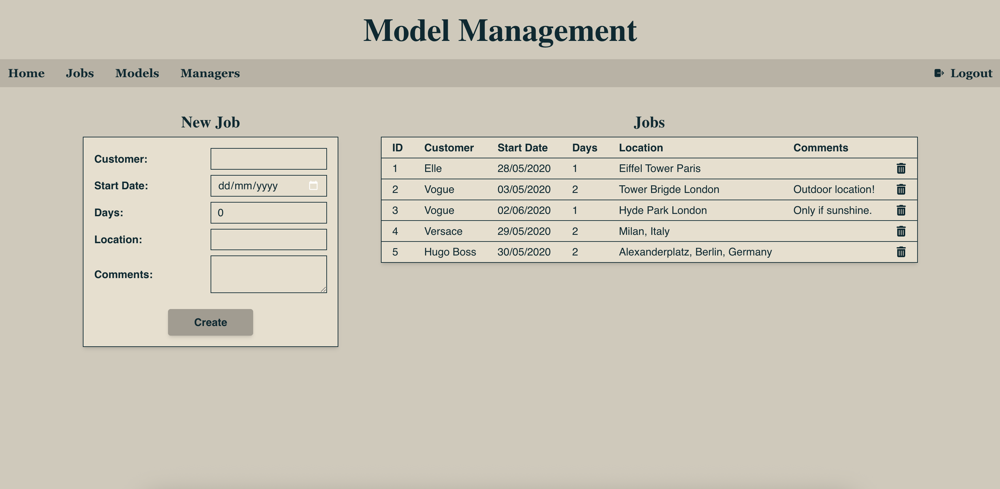
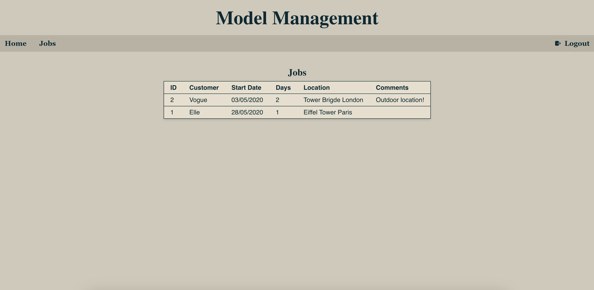
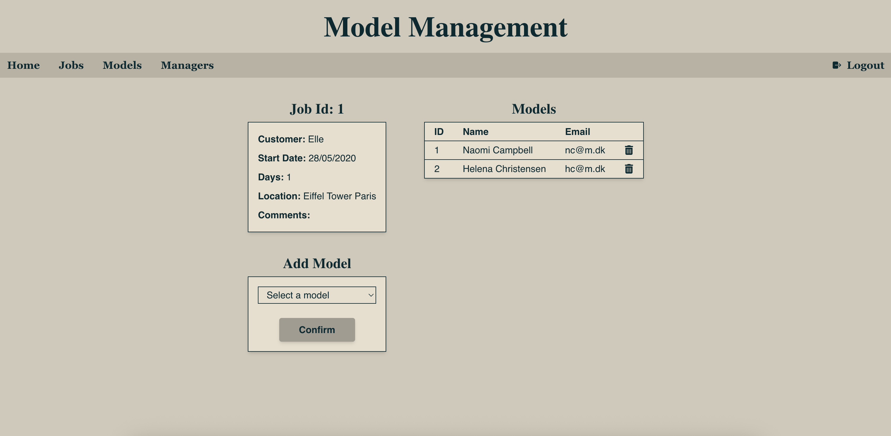
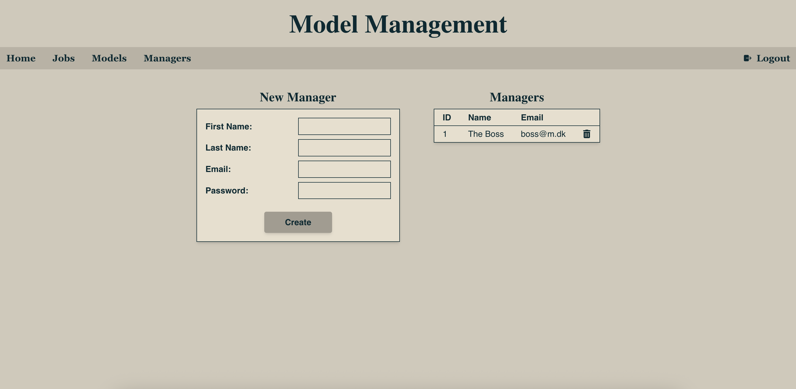
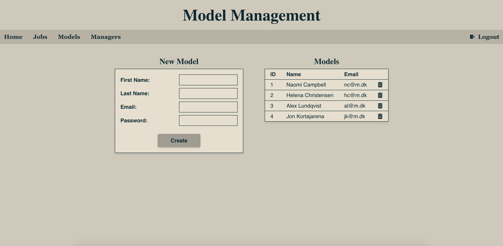

# Model Management System

This web application was developed as part of a frontend development assignment, focusing on the use of the React JavaScript framework.

The system enables managers to oversee all jobs and models, as well as manage team members and model users. Model users can access their own job assignments and efficiently manage their related expenses.

|            **Manager View**            |                   **Model View**                   |
| :------------------------------------: | :------------------------------------------------: |
|              |              |
|  |  |
|      |              |
|          |              |
